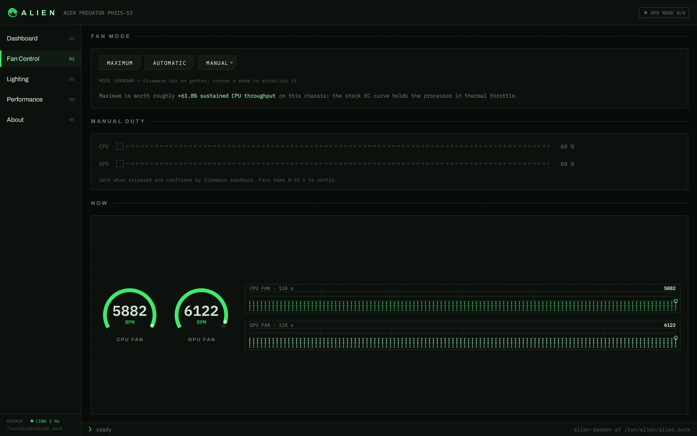
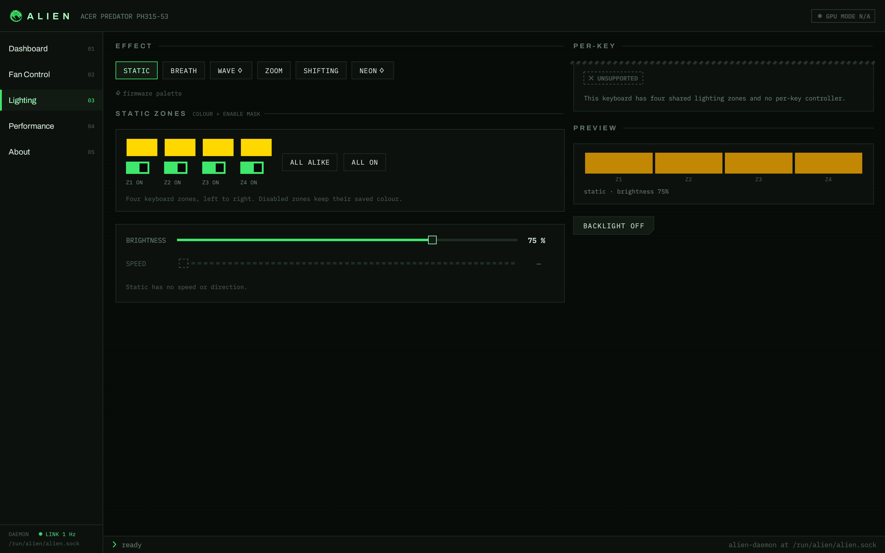
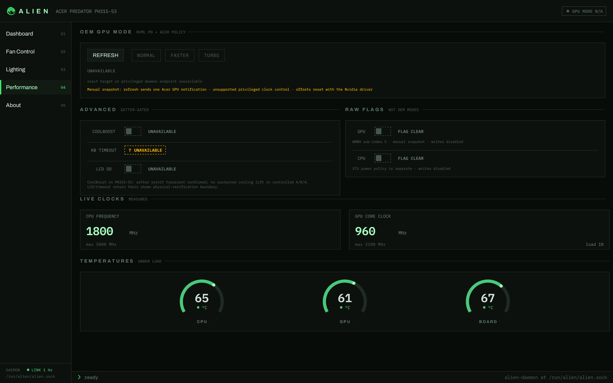
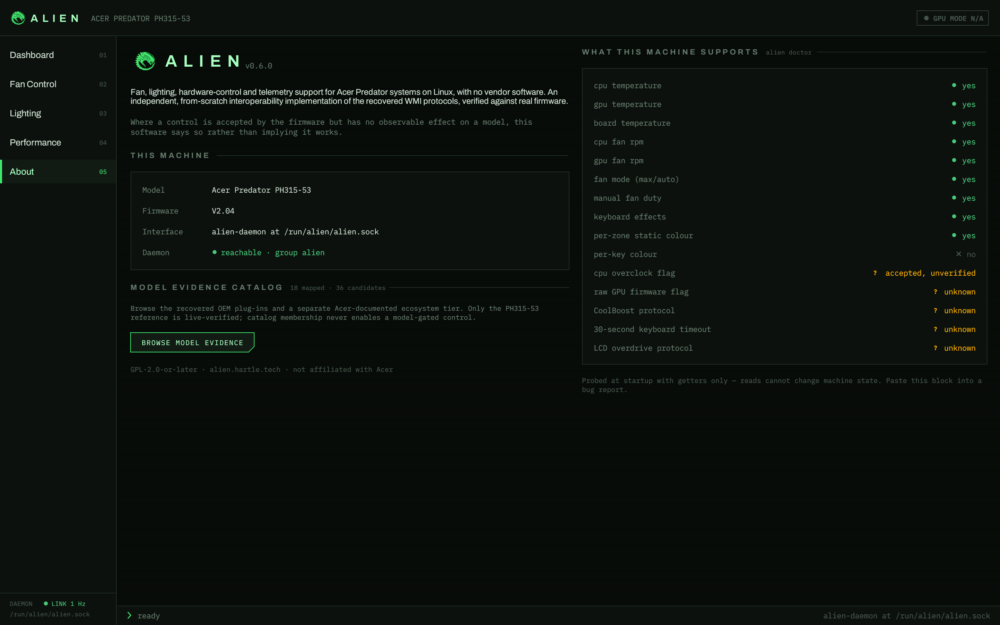
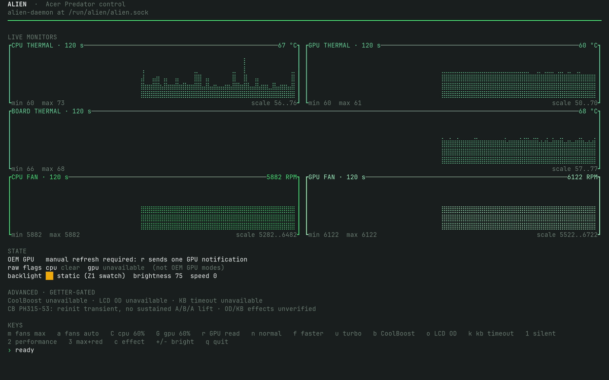

<div align="center">


# Alien

**Take control of your Acer Predator. On Linux. Properly.**

Fans, keyboard lighting, cooling, telemetry, per-game profiles — no Windows, no vendor software.

<p>
  <a href="https://github.com/code-hartle-tech/alien/releases/latest"></a>
  <a href="LICENSE"></a>
  
  
</p>


<sub>Dashboard · Fan control · Lighting · Performance · About — a live Predator Helios 300, nothing staged.</sub>

<br><br>

### Install it in one line

</div>

```sh
curl -fsSL https://alien.hartle.tech/install.sh | sh
```

<div align="center">
<sub>Debian · Ubuntu · Mint · Fedora · Arch · NixOS — picks your package, installs the service, tells you what to do next.<br>
Prefer to read it first? <a href="#install">Every other way to install →</a></sub>
</div>

<br>

## Acer never shipped this for Linux

PredatorSense exists on Windows. On Linux you get a laptop whose fans, keyboard
and thermal behaviour are entirely out of your hands.

**Alien is that missing control panel.** It speaks the real Acer gaming-WMI
protocol — recovered by reverse-engineering PredatorSense itself — so the
firmware treats it exactly like the vendor tool. Set fan modes and per-fan duty,
drive the four keyboard zones and their effects, run a real temperature curve,
read honest telemetry, and bind profiles to the games you play.

Three ways to drive it: a desktop app, a terminal UI that works over SSH, and a
scriptable CLI. One protocol library underneath.

<br>

## What Alien does

<table>
<tr>
<td width="50%" valign="top">

### 🌀 Fans that actually respond
Firmware-auto, maximum, per-fan manual duty, and **independent per-fan modes** — CPU on the curve while the GPU runs pinned.

The stock curve never ramps past ~3500 RPM, so the CPU pins at 92 °C and drops to 1446 MHz. Take the fans off it and the same chip holds 2406 MHz: **+61.8% sustained throughput**, over a 4×20-minute A/B/A. [How it was measured →](docs/evidence.md#measurement-protocol)

</td>
<td width="50%" valign="top">

### 💡 Four-zone keyboard lighting
Per-zone colour and brightness, plus Breathing, Wave, Zoom, Shifting and Neon — driven through the real vendor protocol, not a guess.

Read back per zone, so what the UI shows is what the firmware holds.

</td>
</tr>
<tr>
<td width="50%" valign="top">

### 🌡️ A real cooling curve
`alien-cooling` is a temperature curve with asymmetric hysteresis, dwell timers and a critical latch. Quiet at idle, ramps *before* the chassis saturates.

PredatorSense has no such thing — its "Custom" mode is fixed percentages.

</td>
<td width="50%" valign="top">

### 🎮 Game profiles that survive a crash
Apply a profile for a game and **always get it back** — even on `SIGKILL`, even across suspend.

The baseline is written to disk *before* the hardware is touched, so nothing can strand your fans at 100%.

</td>
</tr>
<tr>
<td width="50%" valign="top">

### 🔍 Tells you *why* it's slow
`alien limiters` reports **which cap is actually binding** — thermal, power, or nothing at all.

No other tool on Linux or Windows reports this. Its absence is why so much tuning advice is folklore.

</td>
<td width="50%" valign="top">

### 📊 Honest telemetry
Five sensors, both fan RPMs, live CPU/GPU clocks and power state — ground-truthed against the kernel and `nvidia-smi`, not guessed.

And `alien doctor` tells you what *your* machine really supports.

</td>
</tr>
</table>

<br>

## Alien vs PredatorSense

Written to be checkable. Where Alien is behind, it says so.

<div align="center">

| | PredatorSense<br><sub>Windows</sub> | **Alien**<br><sub>Linux</sub> |
|---|:---:|:---:|
| Runs on Linux | ❌ | ✅ |
| Fan automatic / maximum | ✅ | ✅ |
| Per-fan manual duty | ✅ | ✅ |
| **Independent per-fan modes** | ❌ | ✅ |
| **Temperature curve with hysteresis** | ❌ | ✅ |
| Four-zone lighting + effects | ✅ | ✅ |
| Per-key lighting | ✅ <sub>per-key models</sub> | ⚠️ <sub>experimental</sub> |
| Per-game profiles | ✅ | ✅ |
| **Profile survives a crash or `SIGKILL`** | ❌ | ✅ |
| **Reports which limiter is binding** | ❌ | ✅ |
| **Scriptable CLI + JSON output** | ❌ | ✅ |
| **Terminal UI, works over SSH** | ❌ | ✅ |
| **Reports what your model really supports** | ❌ <sub>ships dead controls</sub> | ✅ |
| **Serialised firmware access** | unknown | ✅ |
| CoolBoost | ✅ | ⚠️ <sub>works; no benefit measured</sub> |
| GPU Normal / Faster / Turbo | ✅ | ⚠️ <sub>implemented; no speed-up measured</sub> |
| Battery charge limit | ✅ | ❌ <sub>firmware rejects it here</sub> |
| Keyboard backlight timeout | ✅ | ❌ <sub>firmware rejects it here</sub> |
| Boot animation, OSD overlay | ✅ | ❌ |

<sub>Full breakdown, including facer and Linuwu-Sense: <a href="docs/parity.md">docs/parity.md</a></sub>

</div>

<br>

## See it

<div align="center">


<table>
<tr>
<td width="50%"></td>
<td width="50%"></td>
</tr>
<tr>
<td align="center"><sub><b>Fan control</b> — modes, per-fan duty, live RPM</sub></td>
<td align="center"><sub><b>Lighting</b> — four zones, six effects</sub></td>
</tr>
<tr>
<td width="50%"></td>
<td width="50%"></td>
</tr>
<tr>
<td align="center"><sub><b>Performance</b> — clocks, power state, guarded GPU modes</sub></td>
<td align="center"><sub><b>About</b> — what <i>your</i> machine actually supports</sub></td>
</tr>
</table>

<sub><a href="docs/media/README.md">Full-resolution screens and the media kit →</a></sub>

</div>

<br>

## And the same thing over SSH

No desktop, no X, no forwarding. `alien-tui` is the whole dashboard in a
terminal — the same daemon, the same telemetry, the same 1 Hz refresh — so a
headless machine or a locked-down session is not a downgrade.

<div align="center">



<sub>Live gauges, both fan RPMs and rolling history — in 80 columns.</sub>

</div>

```sh
ssh gaming-laptop alien-tui     # the dashboard, from anywhere
ssh gaming-laptop alien json    # or machine-readable, for your own scripts
```

<br>

## Install

<details open>
<summary><b>One line</b> — the path for everyone else</summary>

<br>

```sh
curl -fsSL https://alien.hartle.tech/install.sh | sh
```

It detects your distribution, downloads the matching signed package from the
latest GitHub release, installs the system service, loads `acpi_call`, adds you
to the `alien` group and prints the one thing you still have to do: **log out
and back in.**

Piping to a shell is not for everyone. Read it first instead:

```sh
curl -fsSLO https://alien.hartle.tech/install.sh
less install.sh && sh install.sh
```

`sh install.sh --uninstall` reverses everything it did.

</details>

<details>
<summary><b>Your distribution's package</b></summary>

<br>

Every release attaches native packages. Download from
[the latest release](https://github.com/code-hartle-tech/alien/releases/latest)
and install with your package manager:

```sh
sudo apt install ./alien_*_amd64.deb              # Debian, Ubuntu, Mint
sudo dnf install ./alien-*.x86_64.rpm             # Fedora
sudo pacman -U  ./alien-*-x86_64.pkg.tar.zst      # Arch, Manjaro, EndeavourOS
```

</details>

<details>
<summary><b>NixOS</b> — the directly verified path</summary>

<br>

```nix
{
  inputs.alien.url = "github:code-hartle-tech/alien";

  outputs = { nixpkgs, alien, ... }: {
    nixosConfigurations.my-host = nixpkgs.lib.nixosSystem {
      system = "x86_64-linux";
      modules = [
        alien.nixosModules.default
        { services.alien = { enable = true; users = [ "alice" ]; }; }
      ];
    };
  };
}
```

Rebuild, then log out and back in so the `alien` group reaches your session.

</details>

<details>
<summary><b>Flatpak, Snap and Docker</b></summary>

<br>

Flatpak and Snap ship the **frontends only**. The daemon needs `/proc/acpi/call`
and cannot live in a sandbox at any privilege level, so install a native package
first — then use the sandboxed GUI against it if you prefer.

```sh
flatpak install --bundle tech.hartle.Alien-*.flatpak
sudo snap install --dangerous alien_*_amd64.snap
docker run --rm --privileged ghcr.io/code-hartle-tech/alien:latest status
```

Docker is for CI and headless one-shots, not the desktop. See
[`packaging/`](packaging/README.md).

</details>

<details>
<summary><b>Build from source</b></summary>

<br>

```sh
git clone https://github.com/code-hartle-tech/alien
cd alien/code && cargo build --release --locked --workspace
```

Needs Rust 1.88+. You'll also need the `alien` group, the `acpi_call` kernel
module, the hardened systemd unit and correct socket ownership — don't run a
frontend as root instead.

</details>

<br>

## Use it

```sh
alien doctor                 # is this machine supported, and what's gated
alien status                 # temperatures, RPM, clocks, power
alien limiters watch 60      # which cap is actually binding
alien fan max                # both fans to maximum
alien fan cpu auto           # one fan to the firmware curve, the other untouched
alien profile apply silent   # named profile
alien gamesync begin performance   # apply with a crash-safe restore
```

`alien-gui` for the desktop app · `alien-tui` over SSH · `alien --help` for everything.

<br>

## Does it work on my machine?

**One machine is live-verified** — Predator Helios 300 PH315-53. Eighteen more
are mapped from the vendor's own plug-ins and need hardware receipts; another
thirty-six are unverified candidates.

Run `alien doctor` before anything that writes. Alien reports what *your*
machine actually supports rather than assuming.

→ [Model catalog](docs/model-compatibility.md)

<br>

## Going deeper

| | |
|---|---|
| 👻 [**Ghost in the firmware**](docs/reverse-engineering-predatorsense.md) | How PredatorSense was reverse-engineered |
| 🔧 [**Firmware catalog**](docs/firmware-catalog.md) | What each Acer BIOS version actually ships — and why "2.04 relocks undervolting" is false |
| 📐 [Protocol notes](docs/protocol.md) | WMI, ACPI, lighting and GPU-mode mappings |
| 🔬 [Evidence](docs/evidence.md) | What's proven, what isn't, and three controls that measured *worse* than nothing |
| ⚖️ [Parity](docs/parity.md) | Against PredatorSense, facer and Linuwu-Sense |
| 📦 [Packaging](packaging/README.md) · 🔒 [Security](SECURITY.md) | |

<br>

## Safety

Alien exposes no arbitrary WMI passthrough and no raw embedded-controller
access. Every request passes an allowlist of characterised operations with
exact payload shapes. Membership of the `alien` group is real hardware
authority — grant it deliberately.

<br>

---

## 🛸 Want your Predator supported?

Alien is model-gated on purpose. Rather than poke unproven firmware indices on
someone else's laptop, it refuses what it cannot prove — so a model stays
"candidate" until a real machine reports in.

**If your Acer isn't fully supported yet, that is fixable, and you can fix it.**

<table>
<tr>
<td width="33%" valign="top">

### 1 · Send a report
Run `alien doctor` and open a
[**hardware support request**](https://github.com/code-hartle-tech/alien/issues/new?template=hardware-support.yml).
Paste the output. That alone tells us which protocol family your machine speaks.

Nothing in `alien doctor` writes to your hardware.

</td>
<td width="33%" valign="top">

### 2 · Get a test build
Where the report shows a known protocol family, you get a build with your model
enabled and a short list of things to check — fans, lighting, telemetry.

Every setter is reversible and the daemon restores your baseline on exit.

</td>
<td width="33%" valign="top">

### 3 · You're in the catalog
Confirmed behaviour moves your model from *candidate* to **live-verified**, and
ships enabled for everyone else who owns one.

You get the credit in the model catalog.

</td>
</tr>
</table>

<div align="center">

**[→ Request support for your model](https://github.com/code-hartle-tech/alien/issues/new?template=hardware-support.yml)**

<sub>Not an Acer owner but want to help? <a href="CONTRIBUTING.md">CONTRIBUTING.md</a> · <a href="https://github.com/code-hartle-tech/alien/issues/new?template=bug.yml">Report a bug</a></sub>

</div>

<br>

---

<div align="center">

<sub>GPL-2.0-or-later · An independent interoperability project, not affiliated with or endorsed by Acer.<br>
No Acer software, artwork, firmware or binaries are distributed here — see <a href="NOTICE">NOTICE</a>.</sub>

</div>
