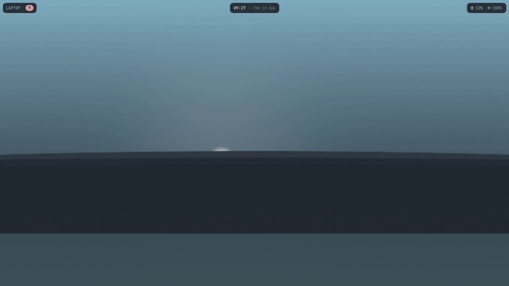
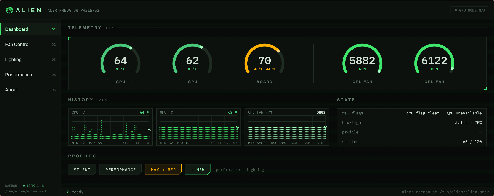
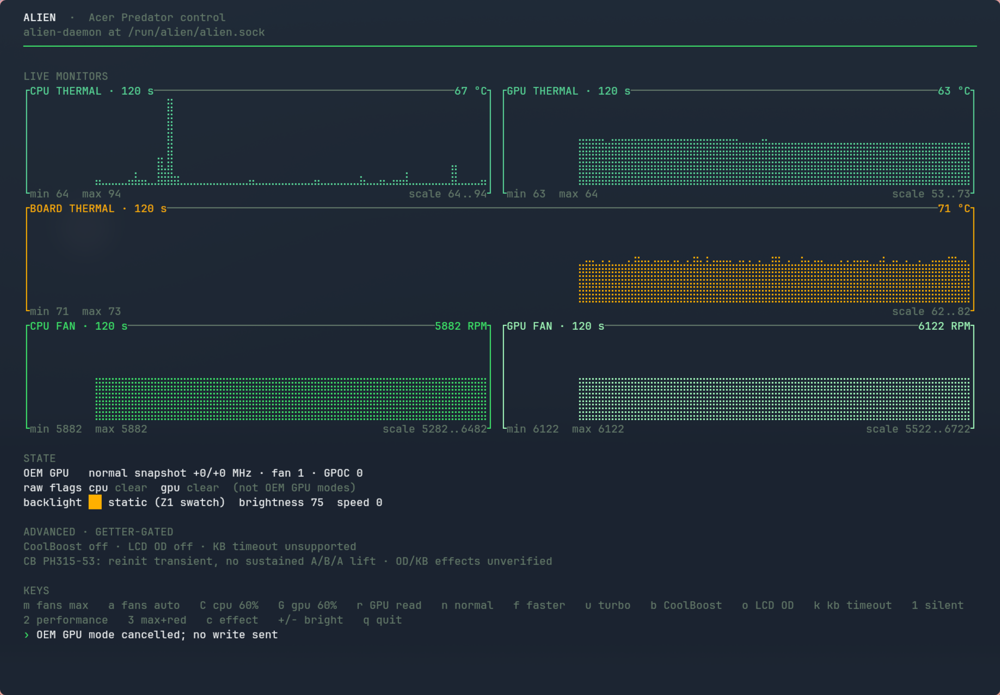

# Alien

<p align="center">
  
</p>

<p align="center">
  <strong>Native Linux control for Acer Predator fans, lighting, telemetry and guarded firmware features.</strong><br>
  Independent, from-scratch interoperability implementation. No Windows runtime. No vendor binaries.
</p>

<p align="center">
  <a href="https://github.com/code-hartle-tech/alien/actions/workflows/ci.yml"></a>
  
  <a href="LICENSE"></a>
  
  
  
</p>

<p align="center">
  <a href="docs/media/README.md"></a>
</p>

Alien turns Acer's undocumented gaming interfaces into a small, typed Rust
stack: a hardened host daemon plus a desktop app, terminal UI and scriptable
CLI. It validates payloads, serialises access to the firmware, and distinguishes
transport success from physical proof.

> [!IMPORTANT]
> Compatibility is evidence-tiered. **One machine is live-verified; 18 models
> are package-mapped in total; 36 more are official PredatorSense research
> candidates whose Alien compatibility is unverified.** Catalog membership is
> never a runtime safety bypass.

## See it in action

| Desktop control centre | Keyboard-first terminal UI |
|---|---|
| [](docs/media/screenshots/alien-gui-dashboard.png) | [](docs/media/screenshots/alien-tui-rich.png) |

[Browse every full-resolution screen and download the MP4/WebM walkthroughs →](docs/media/README.md)

## What Alien provides

- **Fans and telemetry** — firmware-auto, maximum and independent manual duty;
  fan RPM, temperatures, CPU/GPU clocks and power state.
- **Four-zone lighting** — per-zone static colour and brightness, plus the
  model-family mappings for Breathing, Wave, Zoom, Shifting and Neon.
- **Guarded performance controls** — typed CoolBoost, keyboard-timeout and LCD
  overdrive operations, and an exact-target compound GPU-mode transaction with
  readback and rollback.
- **Three frontends** — a live desktop dashboard, an SSH-friendly TUI and an
  automation-ready CLI, all using the same protocol library.
- **Honest state** — unsupported, inferred, getter-confirmed, hardware-measured
  and optically verified results are not collapsed into one green checkmark.

The reference PH315-53 produced **about 48% more sustained 7-Zip throughput**
when its fans were forced to maximum in a same-session comparison:

| Reference-machine run | 7-Zip total | GPU idle |
|---|---:|---:|
| Firmware automatic fan curve | ~26.1k MIPS | 86–89 °C |
| Fans at maximum | **~38.7k MIPS** | **81 °C** |

That is a measurement from one laptop and workload—not a promise for another
model. The OEM Normal/Faster/Turbo GPU sequence also completed and read back on
that target, but its bounded load test showed **no measurable speed-up**.

## Compatibility: evidence before promises

Alien's About screen contains a searchable model evidence catalog. The current
snapshot is intentionally broader than one reference laptop and narrower than
“every Acer gaming PC.”

| Evidence tier | Count | Meaning |
|---|---:|---|
| **Live-verified** | 1 | Predator PH315-53, BIOS V1.07, exercised on real hardware. |
| **Package-mapped** | 18 total | PredatorSense plug-ins identify 18 unique model strings and six protocol families. The live reference is included; the other 17 still need community hardware receipts. |
| **Candidate, unverified** | 36 additional | Official Acer sources associate 33 laptop and 3 desktop codes with PredatorSense. Their Alien protocol mapping and compatibility are unverified. |

This does **not** make Alien “a PH315-53 app.” It means PH315-53 is the first
fully characterized reference in a catalog built to accept evidence from the
rest. See [the complete model catalog](docs/model-compatibility.md) and run
`alien doctor` on the actual machine before attempting a setter.

## Quick start

The supported architecture keeps `alien-daemon` on the host. It needs root and
the out-of-tree `acpi_call` kernel module; the GUI, TUI and CLI remain
unprivileged and talk to its group-owned Unix socket.

### NixOS

Add Alien's module to the target system, then name the users who may access the
hardware-control socket:

```nix
{
  inputs.alien.url = "github:code-hartle-tech/alien";

  outputs = { nixpkgs, alien, ... }: {
    nixosConfigurations.my-host = nixpkgs.lib.nixosSystem {
      system = "x86_64-linux";
      modules = [
        alien.nixosModules.default
        {
          services.alien = {
            enable = true;
            users = [ "alice" ];
          };
        }
      ];
    };
  };
}
```

Rebuild, then sign out and back in so the new `alien` group reaches the desktop
session.

### Other Linux systems

The NixOS module above is the directly supported installation path today. On
another distribution, the reproducible developer path is to build the Rust
workspace with Rust 1.88 or newer:

```sh
cd code
cargo build --release --locked --workspace
```

This produces `alien`, `alien-tui`, `alien-gui`, and `alien-daemon` under
`code/target/release/`. Installing a root daemon also requires an `alien` group,
the `acpi_call` module, the hardened systemd unit, and correct socket ownership;
do not run a frontend as root instead. The checked-in Arch, Debian/Ubuntu,
Flatpak, Snap, and Docker files under [`packaging/`](packaging/README.md) are
maintainer packaging references until their release-artifact pipeline is
published and verified. They are not being advertised here as ready binary
downloads.

## Choose your control surface

### Desktop GUI

```sh
alien-gui
alien-gui --tab lighting
alien-gui --reduced-motion
```

The animated Alien mark doubles as honest connection feedback while the
first daemon contact is pending. Dashboard, Fans, Lighting, Performance and
About views adapt to the detected capabilities rather than exposing every
known control blindly.

### Terminal UI

```sh
alien-tui
```

The TUI keeps live telemetry and guarded actions usable locally or over SSH,
including narrow terminal layouts and explicit confirmation for risky changes.

### CLI

```sh
alien doctor                  # identify the machine and safety gates
alien capabilities            # report what this target exposes
alien status                  # temperatures, RPM, clocks and power
alien fan max                 # force both fans to maximum
alien fan auto                # return both fans to firmware control
alien rgb '#00aec7'           # set all four static zones
alien profile apply silent    # apply a named profile
alien gpu-mode status         # explicit compound-state refresh
```

Run `alien --help` for the full command surface. Mutating commands report what
the firmware said and use getter confirmation wherever the target provides it.

## Architecture

```text
alien-gui ─┐
alien-tui ─┼─► alien-core ─► /run/alien/alien.sock ─► alien-daemon
alien CLI ─┘                                      │
                                                  ├─► serialized acpi_call
                                                  │    └─► WMI / ACPI ─► SMM / EC
                                                  └─► exact-target NVML transaction
```

The daemon is not a raw firmware proxy. Its allowlist accepts only characterized
operations and exact payload/reply shapes. A single owner also prevents clients
from interleaving `/proc/acpi/call`'s global write-then-read buffer.

## Safety model

- Arbitrary WMI passthrough and raw embedded-controller access are not exposed.
- Misc-setting sub-index 6 is denied because it reaches a byte that survives
  power cycles.
- The OEM GPU transaction is limited to one exact DMI/PCI/BIOS target, checks
  the live driver ranges, requires a conspicuous risk acknowledgement, reads
  every leg back, and attempts reverse-order rollback on partial failure.
- Membership in the `alien` group grants real hardware-control authority; add
  users deliberately.

When in doubt, use `alien doctor` and getter-only commands first. `alien fan
auto` hands the fans back to the firmware curve.

## Verification and open gates

On the live reference, fan control, telemetry and independent static-zone
colour have hardware or physical confirmation. Typed GPU modes, CoolBoost and
LCD overdrive have guarded getter/setter/readback evidence with restoration;
the GPU load test was stable but showed no performance lift. The only proven
keyboard-timeout getter returned firmware status `0xe2`, so Alien reports that
control unavailable on this target and sends no write.

Two physical-optics gates remain open:

- the complete keyboard effect, mask, brightness and Off matrix needs a camera
  physically framing the keyboard;
- LCD overdrive needs a 240-fps-or-faster camera filming the physical eDP panel.

A UI screenshot proves interface rendering—not emitted light or panel response.
Alien keeps those claims open until the corresponding optical receipts exist.

## Read the case file

- [**Ghost in the firmware** — how PredatorSense was reverse-engineered](docs/reverse-engineering-predatorsense.md)
- [Acer model evidence catalog](docs/model-compatibility.md)
- [Protocol notes: WMI, ACPI, lighting and GPU-mode mappings](docs/protocol.md)
- [Feature parity and deliberate limits](docs/parity.md)
- [Full-resolution media kit](docs/media/README.md)
- [Ready-to-post Instagram carousel](docs/social/instagram-carousel/README.md)
- [Packaging guide](packaging/README.md)
- [Security policy](SECURITY.md)

## Contributing

Hardware reports are especially valuable. Start with `alien doctor`, keep
read-only evidence separate from physical observations, and never attach
proprietary Acer installers, firmware or decompiler output. The complete test
commands and evidence checklist are in [CONTRIBUTING.md](CONTRIBUTING.md).

## License and independence

Alien is licensed under [GPL-2.0-or-later](LICENSE). It is an independent
interoperability project and is not affiliated with or endorsed by Acer. No
Acer software, artwork, firmware or binaries are distributed in this public
repository; see [NOTICE](NOTICE).
