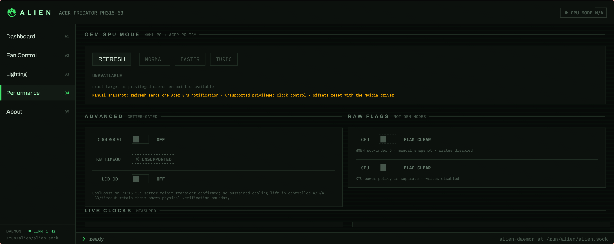
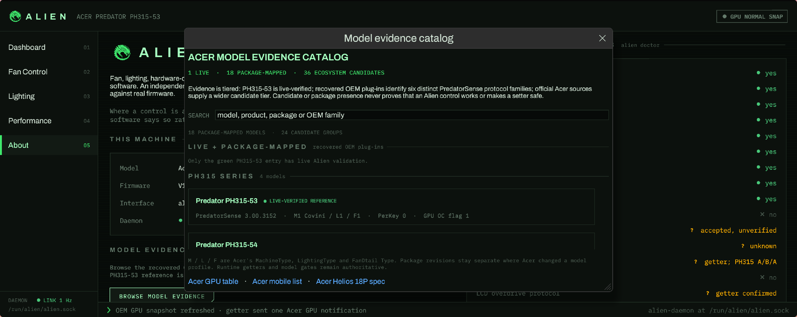
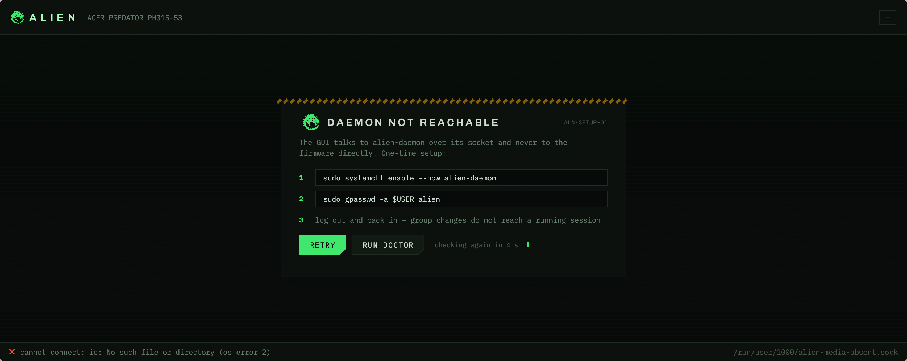
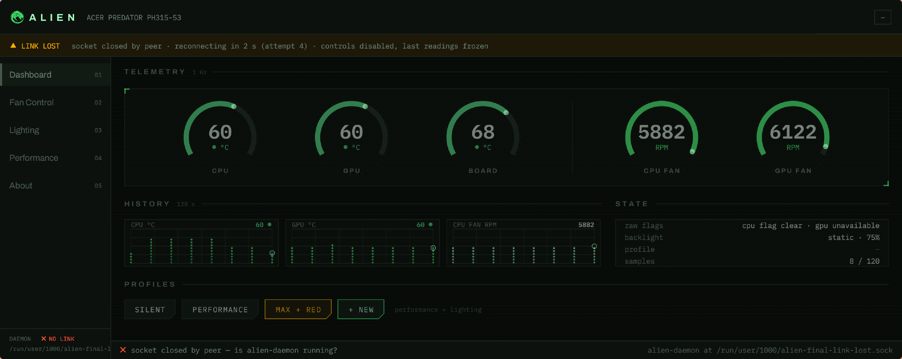
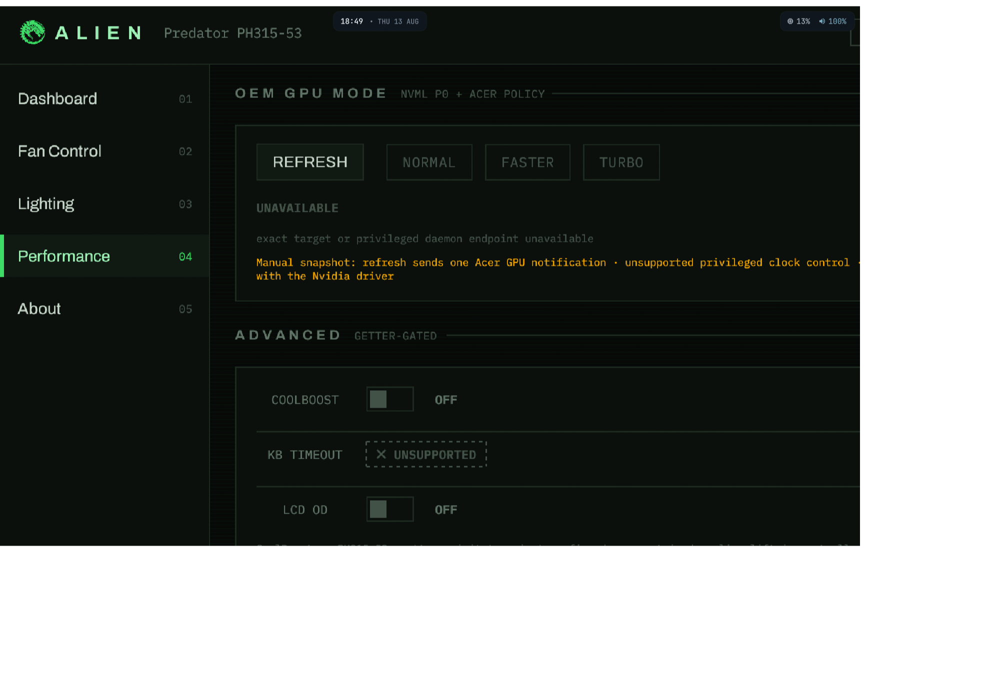
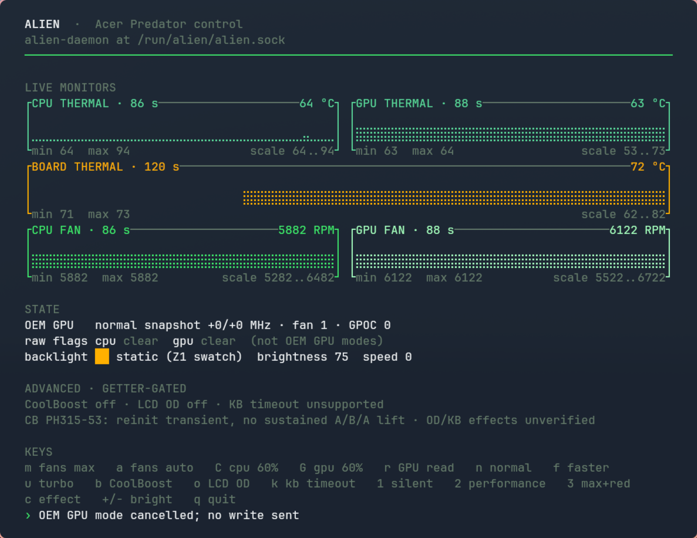
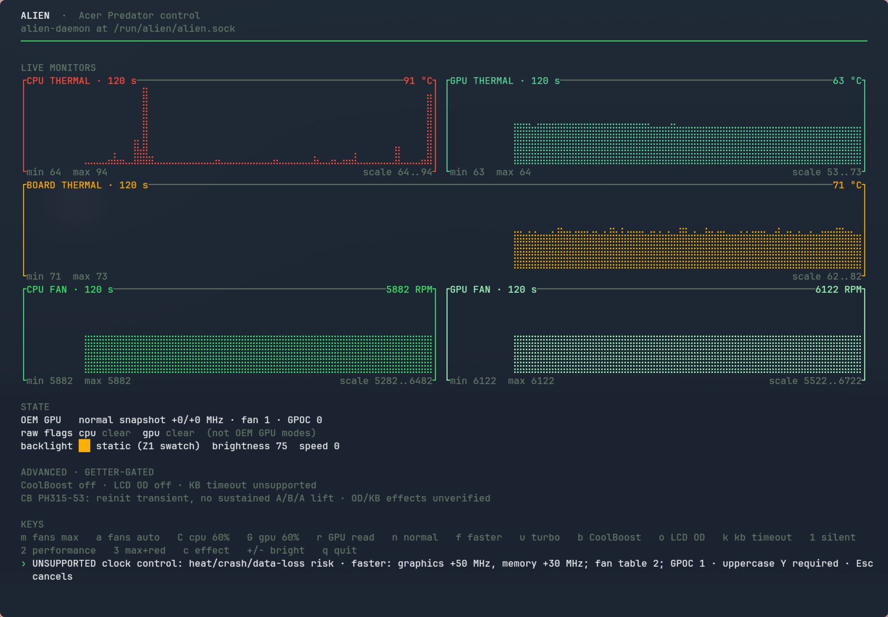

# Alien media kit

Release-ready screenshots and walkthroughs of Alien 0.5.0 are captured from
the deployed application on the live Acer Predator reference system. These
files show interface state; they are not optical evidence for keyboard light
output or LCD panel response. See the receipt below for the frozen-build status
of the currently published set.

## Demo

  

- [GUI walkthrough — MP4](videos/alien-gui-walkthrough.mp4)
- [GUI walkthrough — WebM](videos/alien-gui-walkthrough.webm)
- [TUI walkthrough — MP4](videos/alien-tui-walkthrough.mp4)
- [TUI walkthrough — WebM](videos/alien-tui-walkthrough.webm)
- [Compact animated demo — GIF](demo/alien-demo.gif)

Use MP4 for broad social compatibility, WebM for efficient web delivery, and
the GIF for GitHub surfaces where inline video is unavailable.

Capture method, frozen-build identity, checksums, dimensions, durations and
per-artifact visual verdicts are recorded in the [capture and QA
receipt](CAPTURE.md).

## Desktop GUI

| Screen | Full-resolution capture |
|---|---|
| Startup / daemon contact |  |
| Dashboard |  |
| Fans |  |
| Lighting |  |
| Performance, before manual GPU refresh |  |
| Performance, refreshed |  |
| About |  |
| Model evidence catalog |  |
| First run |  |
| Connection lost |  |
| Narrow responsive layout |  |

## Terminal UI

| Screen | Full-resolution capture |
|---|---|
| Rich layout |  |
| Tight layout |  |
| Guarded-action confirmation |  |

## Reuse

The captures and original HARTLE.TECH-authored Alien project artwork in this
repository, including the project mark, are available under the project's
[GPL-2.0-or-later license](../../LICENSE). Attribute **Alien / HARTLE.TECH** and
link to <https://github.com/code-hartle-tech/alien> when practical.

Alien is not affiliated with or endorsed by Acer. The media kit contains no
Acer artwork, application binaries or firmware images; product and trademark
names appear only to identify interoperable hardware.
